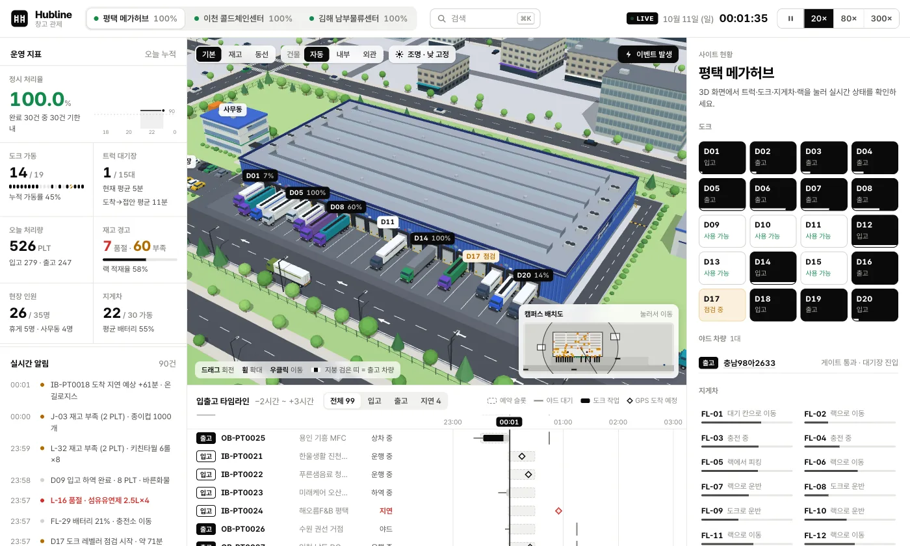
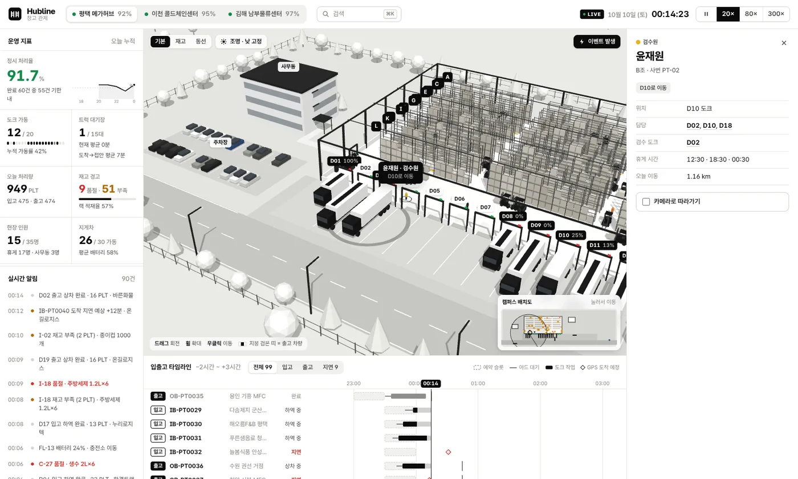
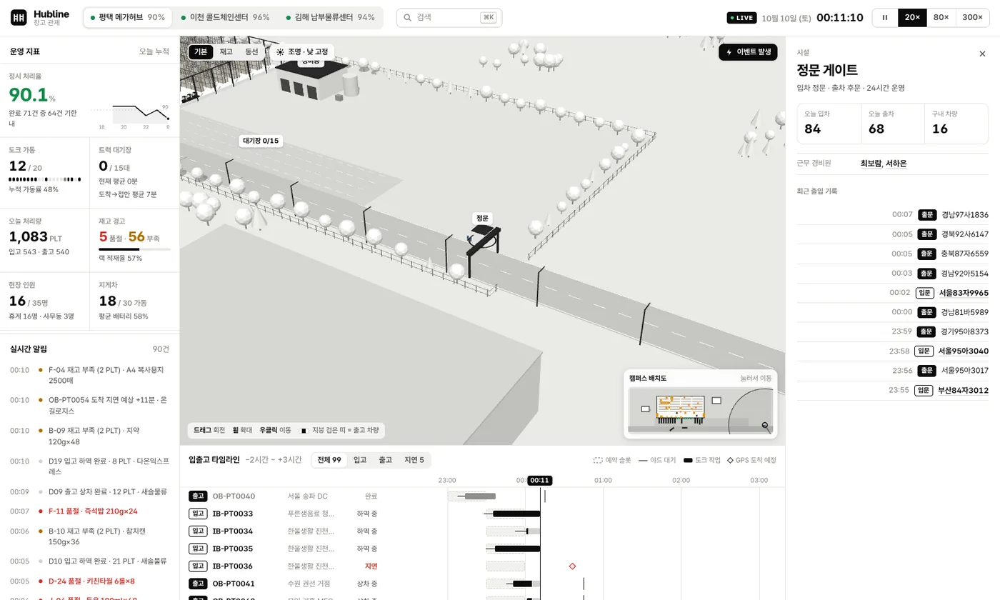
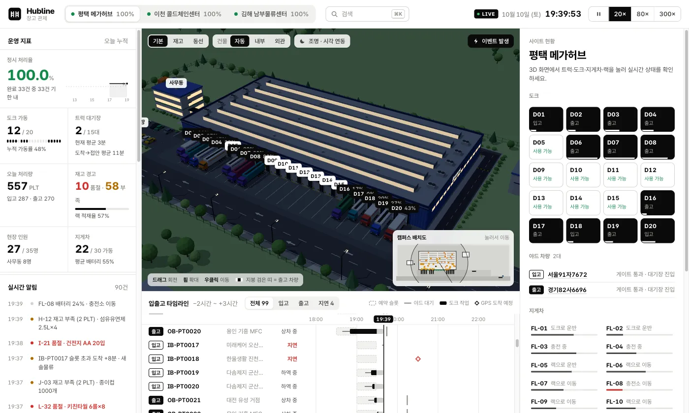
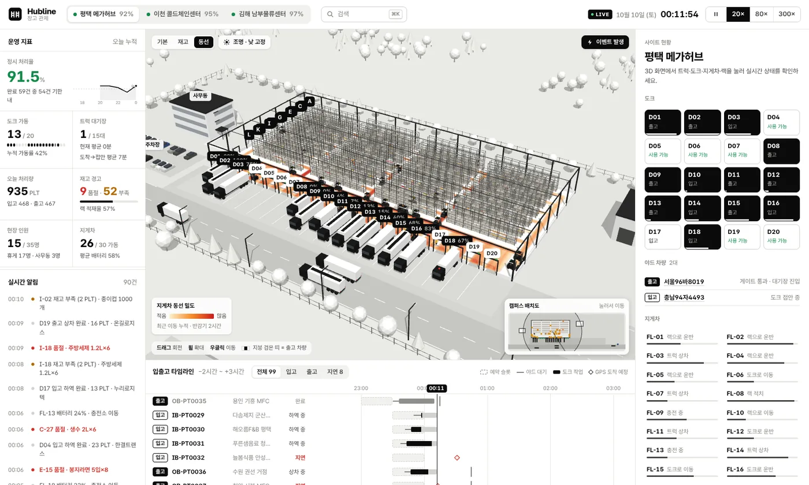
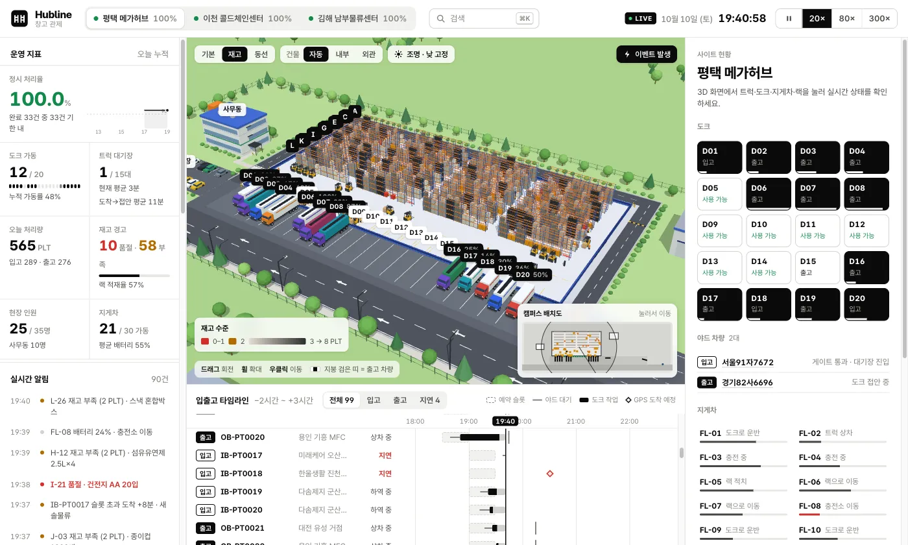
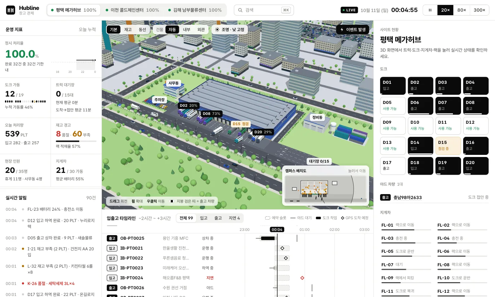

# Hubline — 3D 물류 캠퍼스 관제

**라이브 데모 → https://archibald1948.github.io/hubline-3d/**

React + React Three Fiber로 만든 3D 물류 캠퍼스 관제 앱입니다. Unity 같은 게임 엔진 없이 브라우저에서 돌아갑니다.
트럭·도크·지게차·랙·작업자·건물을 클릭하면 실시간 상태가 뜨고, 캠퍼스 3곳이 시뮬레이션으로 동시에 운영됩니다.



> 모든 데이터는 시드 고정 시뮬레이션이 만든 가상 데이터입니다. 운송사·거래처·차량번호·인명은 실제와 무관합니다.

## 규모

| 사이트 | 건물 | 랙 | 팔레트 칸 | 도크 | 지게차 | 작업자 | 물동량(시간당 계획) |
| --- | --- | --- | ---: | ---: | ---: | ---: | --- |
| 평택 메가허브 | 106 × 53 m | 12열 × 32베이 | 3,072 | 20 | 30 | 35 | 입고 8 · 출고 10 |
| 김해 남부물류센터 | 81 × 47 m | 10열 × 24베이 | 1,920 | 14 | 18 | 26 | 입고 5 · 출고 6.5 |
| 이천 콜드체인센터 | 56 × 41 m | 8열 × 16베이 | 1,024 | 10 | 12 | 19 | 입고 5 · 출고 6 |

캠퍼스마다 정문·후문 게이트(차단기가 실제로 열림), 3레인 트럭 대기장, 사무동, 장비 정비동, 직원 주차장, 울타리, 수백 그루의 나무, 인근 물류단지가 있습니다.

## 할 수 있는 것

| 기능 | 내용 |
| --- | --- |
| 오브젝트 클릭 | 트럭(진행률·슬롯·기한·적재 품목), 도크(회전·가동률·투입 지게차·점검 전환), 지게차(작업·배터리·주행거리), 랙 칸(재고 8슬롯·입출고 예정) |
| 작업자 | 검수원·피커·현장 관리자·사무직·경비원이 역할대로 움직이고, 점심·저녁·야간에 조별로 휴게실에 갑니다. 누르면 현재 작업·담당 도크·이동 거리 |
| 시설 클릭 | 정문(오늘 입·출차, 출입 기록), 트럭 대기장(레인별 대기 차량), 사무동(근무·휴게 인원), 정비동(고장·충전 지게차), 주차장 |
| 실시간 시뮬레이션 | 정문 → 대기장 레인 → 도크 배정 → 후진 접안 → 하역/상차 → 후문 출차. 지게차가 팔레트를 옮길 때마다 랙 재고가 실제로 변함 |
| 충돌 물리 | 트럭·지게차가 경로 진행량·속도·가감속으로 달리고, 실제 외곽(OBB)이 서로 겹치지 않음. 출발 전에 시공간 예약표로 길을 잡아 통로 위 교착이 없고, 지게차는 우측 통행·작업 중인 차 뒤 대기·한가하면 랙 앞 대기 칸으로 빠짐·고장 나면 견인 |
| KPI | 정시 처리율(시간대별 스파크라인), 도크 가동, 대기장, 처리량, 품절·부족, 현장 인원, 지게차 가동·배터리 |
| 입출고 타임라인 | −2h ~ +3h. 예약 슬롯·대기·도크 작업·GPS 도착 예정·지연 |
| 보기 모드 | 기본 / **재고 히트맵**(랙 색 = 재고 수준) / **동선 히트맵**(지게차 이동 누적, 반감기 2시간) |
| 건물 단면 | `건물: 자동 / 내부 / 외관`. 자동이면 확대하거나 대상을 고르거나 재고·동선 모드일 때 지붕이 들려 사라지고 벽이 1 m로 내려가 안이 보임 |
| 외관 | 파란 골판 외벽·창 띠·톱니 천창·옥상 공조기·HUBLINE 간판, 트럭이 접안하면 열리는 롤업 도어, 도크 셸터·노랑/검정 범퍼 |
| 캠퍼스 | 순환 도로·차선·화살표·연석·보도·과속방지턱·볼라드, 잔디·관목·색이 조금씩 다른 나무, 정비동 옆 2단 컨테이너 야드, 운송사 색 트럭 캡과 컬러 컨테이너, 여러 색 주차 차량 |
| 주변 도시 | 캠퍼스 밖 격자 도로(대로 노란 중앙선·횡단보도·신호등·가로등·가로수)와 블록마다 다른 구역: 아파트 단지(단지 안 길), 사무동·1층 상가(뒷골목·샛길), 남쪽 물류단지(하역 앞마당), 공원, 주차장(칸 선). 일반 차량이 교차로 신호에 서고 앞차 간격을 지키며 오가고(시뮬레이션을 멈추면 함께 멈춤), 밤에는 창문이 군데군데 켜짐 |
| 일·야간 조명 | 시뮬레이션 시각에 맞춰 하늘색·해 위치·밝기가 바뀌고 밤에는 가로등·벽등·창 띠·천창·간판·사무동 창이 켜짐 |
| 이벤트 발생 | 긴급 출고 · 입고 몰림 · 지게차 고장 · 트럭 고장 → KPI가 어떻게 흔들리는지 관찰 |
| 미니맵 | 캠퍼스 배치도에 트럭·지게차·작업자·카메라 시야 표시, 누르면 그 지점으로 이동 |
| 통합 검색 | `⌘K` / `Ctrl+K` / `/` — 차량번호·출입고 ID·SKU·품목·도크·지게차·작업자·시설, 전 사이트 대상 |
| 소소한 것 | 고른 대상 위에 파란 지도 핀이 떠서 천천히 오르내림, 나무에 마우스를 올리면 흔들림, 트럭이 다가오면 게이트 차단기가 올라감 |

| 작업자·검수 | 정문 게이트 | 야간 |
| --- | --- | --- |
|  |  |  |

| 동선 히트맵 | 재고 히트맵 |
| --- | --- |
|  |  |



## 실행

```bash
npm install
npm run dev          # http://localhost:5173
npm run build        # dist/
npm run build:single # dist-single/index.html 한 파일 (폰트·JS·CSS 인라인)
```

`main` 브랜치에 푸시하면 GitHub Actions가 빌드해 GitHub Pages에 배포합니다 (`.github/workflows/deploy.yml`).

시뮬레이션만 헤드리스로 점검하려면:

```bash
npx esbuild scripts/simtest.ts --bundle --platform=node --format=esm --outfile=/tmp/simtest.mjs && node /tmp/simtest.mjs
# 시작 시각 바꾸기: SIM_NOW='2026-10-10T00:04:00+09:00' node /tmp/simtest.mjs
# 점검 구간 길이: SIM_HOURS=6 (기본)
```

트럭·지게차 외곽 겹침(같은 쌍의 연속 겹침은 1건), 불변식 위반, 240초 이상 정지(막은 차량 연쇄 포함), 사이트별 처리량·정시율, 워밍업 시간을 출력합니다.

## 구조

```
src/
  sim/              순수 TS 시뮬레이션 (three 의존 없음)
    engine.ts       World → Site × 3, 1초 고정 스텝 — 트럭·지게차·작업자·이벤트·게이트 기록·동선 그리드
    drive.ts        차량 운동: 경로 진행량 s·속도·가감속, OBB 분리축 판정, 직전·현재 스텝 자세 보간
    reserve.ts      시공간 예약표: 격자 칸마다 사용 시간 구간, 겹치지 않는 가장 이른 출발 시각 계산
    layout.ts       섹션·열·도크 수로 건물과 캠퍼스 배치 계산, 지게차·보행 경로
    path.ts         폴리라인/캐트멀롬/모서리 둥글리기 + 시간 기반 모션
    catalog.ts      품목·운송사·거래처·이름 (가상)
  scene/            R3F 3D 뷰 — 데이터를 바꾸지 않고 "보는 방식"만 담당
    Racks.tsx       InstancedMesh: 기둥·빔·팔레트 3,000+개·재고 마커·클릭 히트박스
    Trucks.tsx      트럭 1대 = 병합 지오메트리 1개 (정점 색)
    Forklifts.tsx   지게차(운전자 포함) = 병합 지오메트리 4개 + 포크 승강
    People.tsx      작업자 전원 = InstancedMesh 4개
    Surroundings.tsx 나무(인스턴싱·호버 흔들림, 도시 가로수 포함)·울타리·사무동·정비동·주차장·게이트 차단기
    cityPlan.ts     캠퍼스 밖 도시 계획(도로·구역·필지·골목·건물·가로수·차로)을 시드 고정으로 생성
    cityTraffic.ts  도시 차량 주행: 교차로 신호 위상, 차로별 차간 거리·가감속 (그리기와 분리)
    City.tsx        도시 그리기: 창 격자 외벽(병합 2개), 옥상·상가·창고 디테일, 도로 표시, 가로등·신호등, 차량
    Building.tsx    물류센터 외피(골판 벽·창·지붕·간판·롤업 도어·셸터)와 단면 보기
    Ground.tsx      잔디·도로·야드·차선·연석·볼라드·관목·컨테이너 야드
    Heat.tsx        동선 히트맵 DataTexture
    Lighting.tsx    시각 연동 조명, 가로등 (병합)
    Selection.tsx   선택/호버 링, 3D 라벨, 카메라 포커스
    merge.ts        박스·원통을 정점 색으로 칠해 하나로 합치는 헬퍼
  ui/               관제 패널 (KPI, 알림, 인스펙터, 타임라인, 검색, 툴바, 미니맵)
  store.ts          zustand: 선택·사이트·속도·보기 모드·카메라 이동, 250ms UI 틱
```

### 데이터 모델

`sites → docks / bays(inventory) / trucks / forklifts / workers / shipments / lanes(대기장)`

- **Shipment**: 입고/출고, 30분 예약 슬롯, 기한(입고 = 슬롯 종료, 출고 = 슬롯 종료 + 45분), 품목 라인(로케이션·수량), 긴급 여부
- **Truck**: `enroute → arriving(정문) → queued(대기장 레인) → docking → docked → departing(후문)`
- **Forklift**: 도크↔랙 왕복으로 팔레트 1개씩, 배터리 25% 미만이면 가장 가까운 빈 충전기로, 고장 시 들고 있던 팔레트 원위치 후 재배정
- **Worker**: 역할별 행동 규칙 + 조별 휴게. 건물 안은 통로를 따라, 밖으로는 서측 보행자 출입구를 지나 이동
- **Bay**: 4단 × 2열 = 8 PLT, 입고/출고 예약 수량을 따로 관리해 재고가 음수가 되지 않음
- **정시 처리율**: 입고는 정문 도착 ≤ 슬롯 종료, 출고는 출차 ≤ 출차 마감

3D 화면은 이 데이터의 한 가지 표현일 뿐이라 `sim/`은 그대로 두고 `scene/`만 바꿔 다른 시각화로 교체할 수 있습니다.

### 성능 메모

- 랙·팔레트·마커·나무·관목·컨테이너·울타리·작업자·도크 문은 `InstancedMesh`(색은 instanceColor), 트럭·지게차·건물·지붕·가로등은 정점 색 병합 지오메트리
- 외벽 골판은 월드 좌표 UV + 캔버스 텍스처 1장으로, 벽 전체가 메시 하나
- 단면 보기는 벽 그룹을 땅 아래로 내리는 이동 하나라서 벽에 붙은 문·조명·간판이 따로 처리 없이 함께 숨음
- 3D 위치는 `useFrame`에서 시뮬레이션 객체를 직접 읽고, React 리렌더는 UI 패널만 250ms 간격
- 접속 시 지난 3시간을 미리 시뮬레이션 (3개 사이트 합계 약 0.8~0.9초) — 첫 화면부터 운영 중인 상태
- 같은 자리에서 같은 자리로 가는 운행은 경로·예약 칸을 한 번만 계산해 재사용
- 동선 히트맵 감쇠는 전역 스케일 하나로 처리해 스텝당 O(지게차 수)

## 폰트

Pretendard Variable을 소스에 쓰인 글자만 남겨 서브셋 (2MB → 약 110KB).
UI 문구를 바꾸면 다시 실행: `./scripts/subset-font.sh` (`pip install fonttools brotli` 필요)

## 기술 스택

React 19 · TypeScript · Vite 6 · three.js r176 · @react-three/fiber 9 · @react-three/drei 10 · zustand 5
